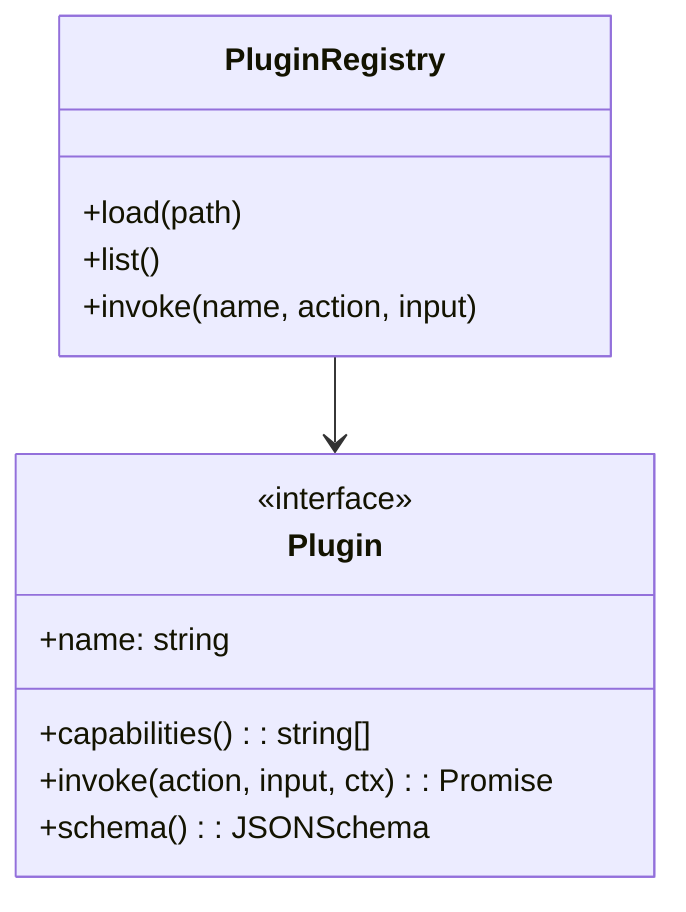

# Gaia CLI — Architecture Blueprint

> A practical, extensible design for a daily-assistant CLI with AI, plugins, automation, and learning.

---

## 0) High-Level Goals

- **Hands-free**: voice or text input; fast output with summaries + detailed drill-down.
- **Extensible**: plugin system for tools (Calendar, Notion, GitHub, Shell, AWS, etc.).
- **Private by default**: local config + secure secrets; optional cloud sync.
- **Reliable**: deterministic mode for automation; retries, timeouts, idempotency.
- **Observable**: logs, traces, metrics; prompt + action history.

---

## 1) System Overview

```mermaid
flowchart LR
    UI[CLI / TUI / Voice] -->|command| Router
    subgraph Core
      Router --> Intent[Intent Parser]
      Intent --> Orchestrator
      Orchestrator --> LLM[LLM Client]
      Orchestrator --> Tools[Tool/Plugin Registry]
      Orchestrator --> Memory[Memory Store]
    end
    Tools --> Ext[External Services]\n(Google, Notion, Slack, GitHub, Shell)
    LLM --> Providers[(OpenAI, Anthropic, Local LLM)]
    Memory --> Store[(SQLite/Chroma/pgvector)]
    Orchestrator --> Audit[(Logs/Telemetry)]
    Orchestrator --> Sched[(Scheduler/Automations)]
```

**Core responsibilities**

- **Router**: maps `jarvis <verb> [object] [flags]` to feature modules.
- **Intent Parser**: light NLP or pattern rules to canonical actions.
- **Orchestrator**: runs tool-augmented steps, handles retries, and streaming output.
- **LLM Client**: prompt templates, tool-call schema, fallbacks, cost control.
- **Tool Registry**: load/unload plugins, capability discovery, permission gating.
- **Memory**: short-term (recent context), long-term (vector DB), user prefs.
- **Scheduler**: cron-like automations & reminders.
- **Audit/Observability**: structured logs, traces, prompt/action history.

---

## 2) Command Design (UX)

- **Core verbs**: `summarize`, `search`, `plan`, `remind`, `note`, `open`, `run`, `git`, `mail`, `meet`, `code-review`.
- **Examples**:
  - `jarvis plan my day --calendar today --focus deep-work`
  - `jarvis summarize inbox --source gmail --top 10`
  - `jarvis run "backup project" --at 23:00 --repeat daily`
  - `jarvis cr --repo myorg/app --since yesterday` (code review)
- **Flags**: `--dry-run`, `--json`, `--no-ai`, `--model gpt-4o`, `--timeout 30s`.

---

## 3) Plugin Architecture



- **Isolation**: each plugin runs with a bounded timeout, rate-limit, and capability-based access.
- **Manifests**: declare actions, input schema, required secrets, scopes (e.g., `calendar.read`).
- **Transport**: in-process first; allow out-of-process (local HTTP/STDIO) for other languages.
- **Security**: permission prompts on first use; signed plugins optional.

**Starter plugins**

- `calendar` (Google, Outlook), `notes` (Notion/Obsidian), `tasks` (Todoist/Jira), `comm` (Slack/Email), `git` (GitHub/GitLab), `shell` (idempotent ops), `web` (browserless)

---

## 4) Memory & Knowledge

```mermaid
flowchart TB
    subgraph Memory Layers
      ST[Short-term\n(session buffer)]
      LT[Long-term\n(vector store)]
      Pref[User Prefs\nYAML/JSON]
    end
    ST --> Summarizer
    Summarizer --> LT
```

- **Short-term**: last N interactions; rolling window.
- **Long-term**: vector DB (embeddings) for notes, docs, transcripts.
- **Summarizer**: periodically compresses history (RAG-friendly chunks).
- **Pref store**: model choices, allowed tools, quiet hours, style.

**Vector store options**

- Local: SQLite+`sqlite-vss` / `Chroma` / `FAISS`.
- Cloud: `pgvector` on Postgres, Pinecone, Weaviate, Qdrant.

---

## 5) Orchestration Patterns

- **Toolformer loop**: LLM proposes tool calls → execute → feed results → final.
- **Deterministic branch**: for `--no-ai`, use rules & regex parsers.
- **Streaming**: token-by-token output for perceived latency.
- **Guardrails**: JSON schema validation, redaction, prompt budget, max tools.
- **Fallbacks**: Model A → Model B → rules; cache common queries.

---

## 6) Tech Stack Options

### A) Python (fastest to build, AI-first)

- CLI/TUI: `typer` + `rich` / `textual`
- AI: `openai`/`anthropic`, `pydantic` for schemas, `litellm` for routing
- Plugins: entry-points or `importlib.metadata`
- Memory: `sqlite3` + `chromadb` or `faiss`
- Scheduler: `apscheduler`
- Packaging: `uv`/`poetry`, `pyinstaller`

### B) Go (single static binary, ops-friendly)

- CLI: `cobra` + `viper`; TUI: `bubbletea`
- AI: REST gRPC clients; JSON schema via `go-jsonschema`
- Plugins: Go plugins (same-ABI) or sidecars via STDIO/HTTP
- Memory: SQLite + `sqlite-vss` or Postgres + `pgvector`
- Scheduler: `robfig/cron`
- Packaging: `goreleaser`

### C) Node/TypeScript (ecosystem + DX)

- CLI: `oclif` or `commander`; TUI: `ink`
- AI: `openai`, `ai-sdk`, `zod` for validation
- Plugins: npm package manifests + dynamic import
- Memory: SQLite (`better-sqlite3`) + `pgvector`
- Scheduler: `node-cron`
- Packaging: `pkg` / `nexe` / `bun` single-file

---

## 7) Config, Secrets, and Profiles

```
~/.jarvis/
  config.yml     # profile = work|home; default model; tool allowlist
  secrets.json   # encrypted (age/sops); token per service
  plugins/
    <plugin>.toml  # manifests, scopes, schema
cache/
logs/
```

- **Profiles**: `jarvis --profile work` switches accounts & calendars.
- **Secrets**: stored encrypted; auto-rotate; masked in logs.

---

## 8) Observability & Safety

- **Structured logs**: JSON; levels; correlation-id per command.
- **Tracing**: OpenTelemetry (span per tool call & LLM request).
- **Metrics**: command latency, tool error rates, token costs.
- **Safety**: dry-run, confirmation prompts for destructive ops, sandboxed shell.

---

## 9) Minimal Implementation Slices

### Slice 1: Core CLI + Orchestrator + One Plugin

1. `jarvis summarize <path|url>`
2. Orchestrator → LLM → simple `web`/`file` reader plugin
3. Stream output + save summary to notes

### Slice 2: Tasks + Calendar + Automations

1. `jarvis plan my day` → fetch calendar + tasks
2. LLM builds schedule → ask for confirmation → create events
3. `jarvis remind "standup" --at 09:25 --repeat wd`

### Slice 3: Code Review Assistant

1. `jarvis cr --repo <repo> --since <time>`
2. Pull PRs/commits; RAG over diffs; produce review with checklists

---

## 10) Reference Prompts (LLM)

- **System**: "You are Jarvis, a CLI assistant. Keep answers concise by default; offer `--verbose` for details. If a tool is needed, propose the call as JSON with action + args."
- **Tool call format**:

```json
{
  "action": "calendar.create_event",
  "args": {"title": "Focus block", "start": "2025-08-16T09:00+07:00", "duration_min": 90}
}
```

- **Guardrails**: "Never execute shell without `--allow-shell` flag. For file write ops, present diff first unless `--yes`."

---

## 11) Sample Folder Structures

### Python

```
jarvis/
  cli.py
  core/
    router.py orchestrator.py memory.py llm.py
  plugins/
    calendar/__init__.py plugin.py
    web/__init__.py plugin.py
  config/
  tests/
```

### Go

```
cmd/jarvis/main.go
internal/core/{router,orchestrator,llm,memory}
internal/plugins/{calendar,web}
configs/
```

### Node/TS

```
src/
  index.ts
  core/{router,orchestrator,llm,memory}.ts
  plugins/{calendar,web}/index.ts
```

---

## 12) Code Starters

### Python (Typer + Rich)

```python
import typer
from rich.console import Console
from core.orchestrator import run_command

app = typer.Typer()
console = Console()

@app.command()
def plan(day: str = "today", verbose: bool = False):
    result = run_command({"cmd": "plan", "day": day})
    console.print(result if verbose else result[":summary"])

if __name__ == "__main__":
    app()
```

### Go (Cobra)

```go
var rootCmd = &cobra.Command{Use: "jarvis"}
var planCmd = &cobra.Command{
  Use:   "plan",
  RunE: func(cmd *cobra.Command, args []string) error {
    return orchestrator.Run(map[string]any{"cmd": "plan"})
  },
}

func init(){ rootCmd.AddCommand(planCmd) }
```

### TS (oclif)

```ts
export default class Plan extends Command {
  static description = 'Plan your day';
  async run(){
    const res = await orchestrator.run({ cmd: 'plan', day: 'today' });
    this.log(res.summary);
  }
}
```

---

## 13) Testing & Quality

- **Unit**: mock LLM + plugins; snapshot prompts.
- **E2E**: run binary against sandbox services.
- **Contracts**: JSON Schema for tool I/O; refuse malformed.

---

## 14) Security Notes

- Principle of least privilege for plugins.
- Signed plugins (optional) and checksums on install.
- Redact secrets from prompts/logs; PII scrubbing.

---

## 15) Roadmap (90 Days)

1. **Week 1–2**: scaffolding, config, logging, 1–2 plugins (web, calendar)
2. **Week 3–4**: memory + RAG; summarizer; notes plugin
3. **Week 5–6**: automations + scheduler; profiles; cost tracking
4. **Week 7–8**: code-review plugin; TUI; plugin marketplace skeleton
5. **Week 9–12**: hardening (tests, telemetry), packaging, docs

---

## 16) Pick-Your-Stack Cheat Sheet

- **AI-first + speed to MVP** → *Python* (Typer, Rich, APScheduler, SQLite+Chroma)
- **Ops-first + single binary** → *Go* (Cobra, BubbleTea, SQLite+pgvector)
- **Web-dev DX + reusable JS code** → *TypeScript* (oclif, Ink, better-sqlite3)

---

**Next**: tell me your preferred stack (Python/Go/TS) and we’ll turn this into a runnable skeleton project with 1–2 core commands and a sample plugin.

